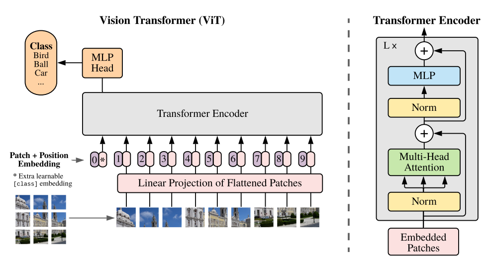
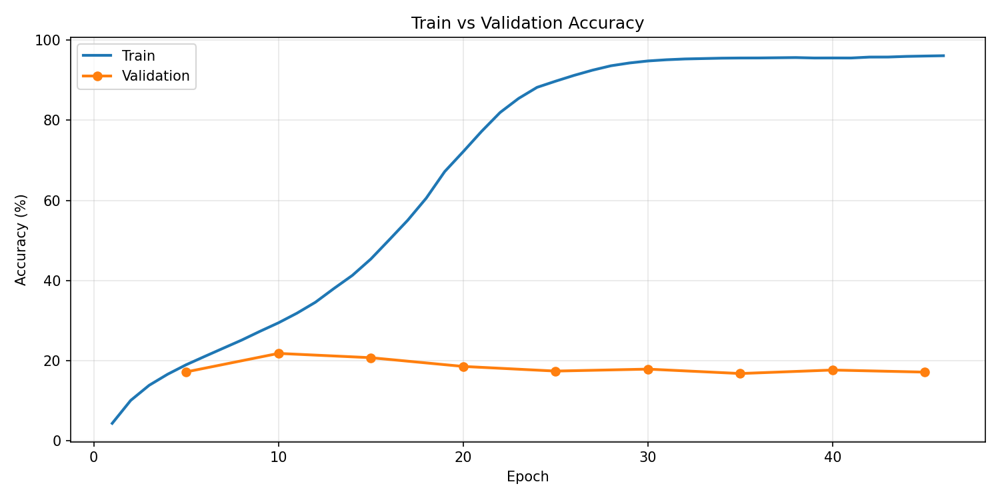
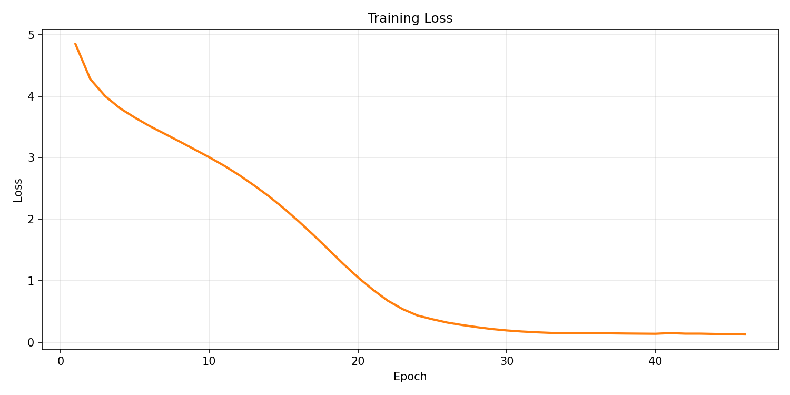

# vitrax

A Vision Transformer trained on Tiny ImageNet (200 classes), built entirely with `jax.numpy`. No autograd. Every gradient through every layer, multi-head self-attention, patch embeddings, layer normalization, the full encoder stack, all hand derived and implemented manually.

## what is this

An implementation of the Vision Transformer from [An Image is Worth 16x16 Words](https://arxiv.org/abs/2010.11929) (Dosovitskiy et al., 2020), built using only `jax.numpy`. The idea behind ViTs is simple: cut an image into patches, treat each patch like a token, and run a Transformer on the sequence. No convolutions, no pooling, no feature maps. Just attention over patches.

The model takes a 64x64 RGB image, splits it into 64 patches of 8x8, projects each patch into a 256 dimensional embedding, prepends a learnable CLS token, adds positional embeddings, and passes the full sequence through 8 encoder blocks. The CLS token at the output gets projected to 200 classes.

Every layer, every gradient, every weight update is implemented by hand. No autograd, no framework backward pass. All gradients numerically verified against finite differences to `1e-11` precision.

## architecture

<p align="center">
  
</p>

<p align="center"><sub>Figure 1 from Dosovitskiy et al. (2020)</sub></p>

Config: `patch_size=8`, `channels=3`, `d_model=256`, `heads=8`, `layers=8`, `seq_len=64`, `num_classes=200`, `batch_size=64`

Each encoder block contains multi-head self-attention with 8 heads (d_k=32), a two layer feed-forward network that expands from 256 to 1024 and back down to 256 with GELU activation, and post-norm residual connections. Positional embeddings are learned, not sinusoidal. The classification head is a single dense layer applied to the CLS token output.

The new components compared to a standard Transformer are the patch embedding (reshaping and projecting image patches into token space) and learned positional embeddings instead of sinusoidal. The rest is the same encoder stack: multi-head self-attention, feed-forward networks, layer normalization, residual connections. But the backward passes through patch embedding are new, flowing gradients from token space back through the linear projection into image patch space.


## results

Trained on Tiny ImageNet (100k images, 200 classes, 64x64 RGB) on a Kaggle P100. No data augmentation, no dropout, no learning rate scheduling. Just the raw architecture with AdamW.


| | |
|---|---|
| Best Validation Accuracy | **21.84%** |
| Training Accuracy | 96.11% |
| Random Chance | 0.50% (1/200) |


ViTs lack the inductive biases that CNNs have. Convolutions bake in translation invariance and locality, meaning the network already "knows" that nearby pixels matter before it sees a single training example. Transformers have none of that. Every spatial relationship has to be learned from scratch, purely from data. The original ViT paper needed JFT-300M (300 million images) to reach competitive performance with CNNs. This model was trained on 100k images with no data augmentation, no dropout, and no learning rate scheduling, which means it had to discover both what features matter and where they are in the image, all from a relatively small dataset with nothing to prevent it from memorizing.

The train vs validation curve tells the story. The model picks up real features early on, then starts memorizing the training set as capacity outpaces the data. Classic overfitting when you have a high capacity model with no data augmentation or dropout to keep it honest.

<p align="center">
  
</p>

<p align="center">
  
</p>

## what is built from scratch

The entire forward and backward pass. Patch embedding with linear projection, learned positional embeddings with CLS token, scaled dot product attention, multi-head attention with head splitting and concatenation, layer normalization, GELU activation, position-wise feed-forward networks, residual connections, categorical cross-entropy loss, and AdamW with bias correction and decoupled weight decay.

## project structure

```
.
├── model/
│   ├── VIT.py                          # full ViT: patch embed + position embed + encoder + classification head
│   ├── encoder.py                      # stacks N encoder blocks
│   ├── EncoderBlock.py                 # MHA + FFN + residual + layer norm
│   └── layers/
│       ├── multiheadAttention.py       # scaled dot product attention, 8 heads
│       ├── FeedForward.py              # two layer FFN with GELU
│       ├── dense.py                    # linear projection with manual backward
│       ├── LayerNorm.py                # layer normalization with manual backward
│       ├── Activation.py               # GELU activation
│       ├── PatchEmbedding.py           # image to patch sequence
│       ├── PositionEmbedding.py        # learned positional embeddings + CLS token
│       └── optim/
│           ├── adamw.py                # AdamW optimizer from scratch
│           └── loss.py                 # categorical cross entropy
├── data/
│   └── dataloader.py                   # loads Tiny ImageNet, batches on the fly
├── train.py                            # training loop with checkpointing
├── evaluate.py                         # validation evaluation
├── configs.yml                         # hyperparameters
└── requirements.txt
```

## usage

```bash
pip install -r requirements.txt
```

Download Tiny ImageNet from http://cs231n.stanford.edu/tiny-imagenet-200.zip

```bash
python train.py       # train
python evaluate.py    # evaluate on validation set
```

## references

Dosovitskiy, A., Beyer, L., Kolesnikov, A., Weissenborn, D., Zhai, X., Unterthiner, T., Dehghani, M., Minderer, M., Heigold, G., Gelly, S., Uszkoreit, J., & Helling, N. (2020). An Image is Worth 16x16 Words: Transformers for Image Recognition at Scale. *ICLR 2021*.

Kingma, D. P. & Ba, J. (2015). Adam: A Method for Stochastic Optimization. *ICLR*.

Loshchilov, I. & Hutter, F. (2019). Decoupled Weight Decay Regularization. *ICLR*.

## license

MIT
